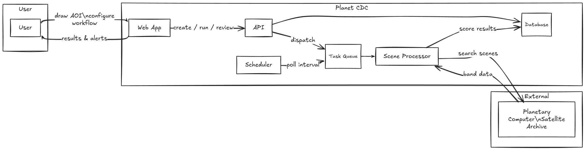

# planet-cdc

A satellite scene scoring platform. Draw an AOI, pick models and collections, run a workflow - get a scored table of satellite scenes.



## Running

```bash
docker compose up -d
```

- Frontend: http://localhost:3000
- API + docs: http://localhost:8000/docs

## Models

| Slug | Scores |
|---|---|
| `ndwi-water-detector` | `ndwi_mean`, `water_fraction` |
| `lst-detector` | `lst_mean`, `hot_fraction` |

## Collections

`landsat-c2-l2` · `landsat-c2-l1` · `sentinel-2-l2a`

## Adding a model

Create a class in `backend/worker/models/` extending `BaseModel`, register it in `backend/worker/models/registry.py`, rebuild:

```bash
docker compose build api worker && docker compose up -d
```

## Adding a collection

Add a `CollectionInfo` entry to the `collections` dict in `backend/worker/providers/planetary_computer.py`, define its bands as `BandInfo(normalized_name, asset_key, description)` - the `normalized_name` is what models reference (e.g. `"green"`, `"nir"`, `"thermal1"`), rebuild:

```bash
docker compose build api worker && docker compose up -d
```
